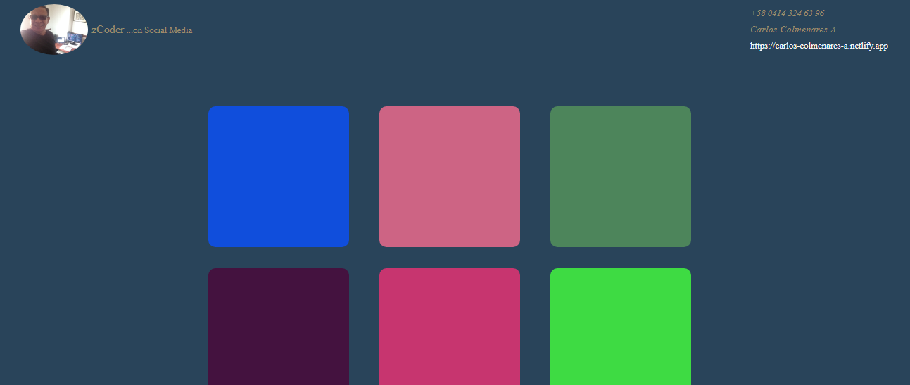

# Creación y eliminación dinámica de bloques de div a medida que se hace scroll

Este proyecto consiste en la creación dinámica de bloques de div a color, a medida que se va haciendo scroll, y eliminación animada y dinámica de los bloques a medida que se hace scroll en reversa. Proyecto desarrollado en HTML y CSS básico, y con JAVASCRIPT vainilla.

 

---

 

 

Take a look at the website at the following link [Github Pages] (https://cycscarlos.github.io/Scroll-Reveal-Elements):

 

---

## Instalación

1. Clona este repositorio en tu máquina local.
2. Navega hasta la carpeta del proyecto.
3. Abre el archivo `index.html` en tu navegador web.

## Uso

- La página mostrará una representación visual del átomo de carbono-12.
- Haz clic en el botón de información para revelar detalles sobre las capas internas y externas del átomo, así como información sobre el núcleo.
- Utiliza los controles en pantalla para ajustar la animación del átomo.

## Requisitos

- Navegador web moderno compatible con HTML5.

## Contribución

Si deseas contribuir a este proyecto, sigue los siguientes pasos:

1. Haz un fork de este repositorio.
2. Crea una rama con tu nueva funcionalidad: `git checkout -b nueva-funcionalidad`.
3. Realiza tus cambios y haz commit: `git commit -m 'Agrega nueva funcionalidad'`.
4. Haz push a la rama: `git push origin nueva-funcionalidad`.
5. Envía una pull request.

## Contacto

Si tienes alguna pregunta o sugerencia, no dudes en contactarme a través de mi correo electrónico: [ccolmenaresa@gmail.com](mailto:ccolmenaresa@gmail.com).

¡También puedes ver mi perfil para información de contacto en redes sociales y algo más... en el siguiente link: [Carlos Colmenares A.](https://carlos-colmenares-a.netlify.app)!
